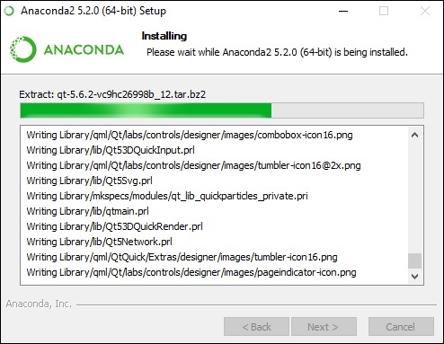

## **Introduction to TensorFlow**

**TensorFlow** is an end-to-end open source platform for machine learning. TensorFlow is a rich system for managing all aspects of a machine learning system; however, this class focuses on using a particular TensorFlow API to develop and train machine learning models.

See the TensorFlow **[documentation](https://www.tensorflow.org/learn)** for complete details on the broader TensorFlow system. 

**TensorFlow** is a software library or framework, designed by the Google team to implement machine learning and deep learning concepts in the easiest manner. It combines the computational algebra of optimization techniques for easy calculation of many mathematical expressions. 
 
#### **Important features of TensorFlow**
- It includes a feature of that defines, optimizes and calculates mathematical expressions easily with the help of multi-dimensional arrays called tensors.

- It includes a programming support of deep neural networks and machine learning techniques.

- It includes a high scalable feature of computation with various data sets.

- TensorFlow uses GPU computing, automating management. It also includes a unique feature of optimization of same memory and the data used.

TensorFlow is well-documented and includes plenty of machine learning libraries. It offers a few important functionalities and methods for the same.

TensorFlow is also called a “Google” product. It includes a variety of machine learning and deep learning algorithms. TensorFlow can train and run deep neural networks for handwritten digit classification, image recognition, word embedding and creation of various sequence models. 

### **TensorFlow - Installation**

To install TensorFlow, it is important to have “Python” installed in your system. Python version **3.4+** is considered the best to start with TensorFlow installation. 

A user can pick up any mechanism to install TensorFlow in the system. We recommend “pip” and “Anaconda”. Pip is a command used for executing and installing modules in Python.

We encourage you to install  Anaconda framework in our system. 

